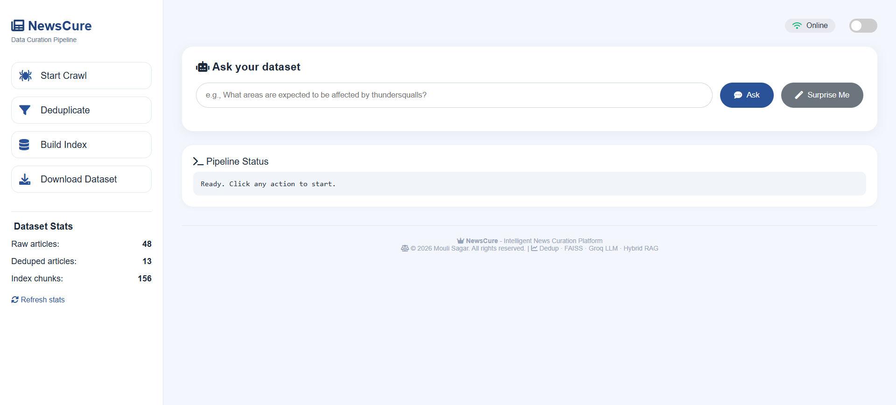
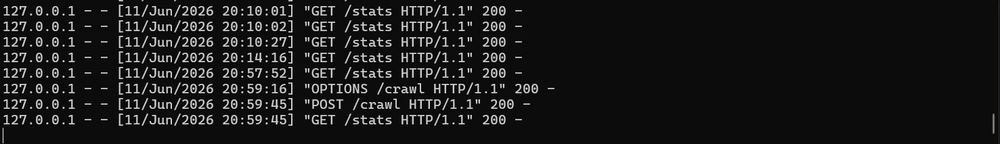
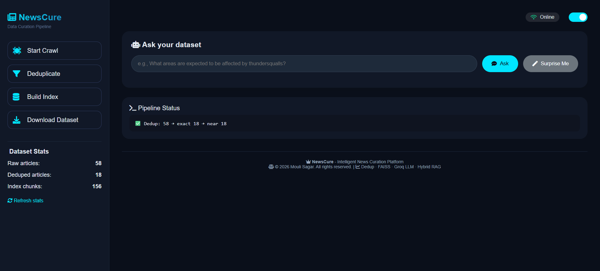
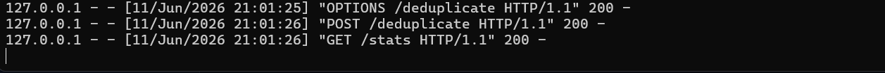
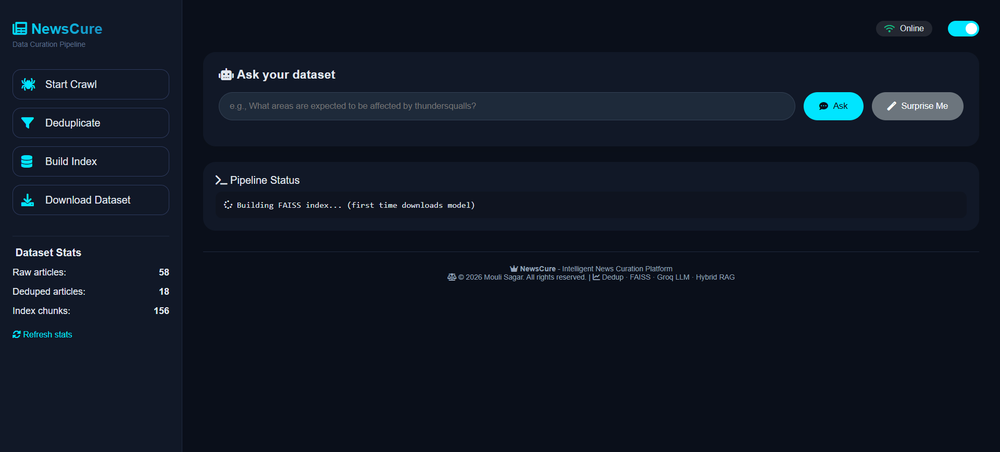
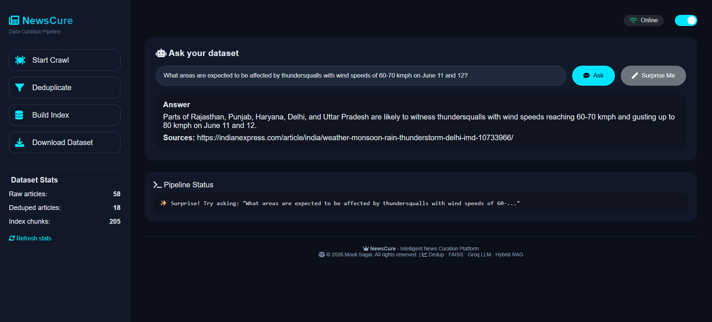
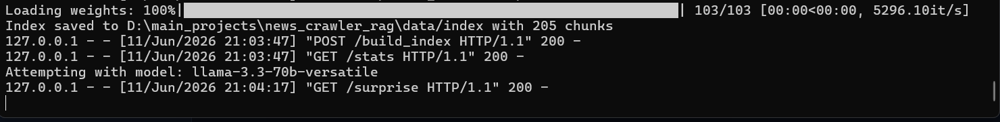

# Regional News Crawler


> Crawl live regional news, remove duplicates (exact + near-duplicate), build a FAISS index, and ask questions with a real LLM. Download the cleaned dataset in Parquet format.
> **A complete data curation pipeline for foundation model training.**

---

## Table of Contents

- [The Story Behind This Project](#the-story-behind-this-project)
- [What This Project Does](#what-this-project-does)
- [How It Works](#how-it-works)
- [Screenshots](#screenshots)
- [Real Challenges & Solutions](#real-challenges--solutions)
- [Development Timeline](#development-timeline)
- [Project Structure](#project-structure)
- [Setup & Running](#setup--running)
- [Limitations & Future Work](#limitations--future-work)
- [Why This Project Matters](#why-this-project-matters)

---

## The Story Behind This Project

A few months ago, I was exploring how to build a **question-answering system** over Indian news. I quickly realized that while large language models (LLMs) are powerful, they **hallucinate** when asked about recent events. The obvious solution was **Retrieval-Augmented Generation (RAG)** - give the LLM the relevant articles and let it answer from them.

But that opened a new set of problems:

- Where do I get fresh, **structured** news articles automatically?
- How do I **clean** them - removing exact duplicates and near-identical rewrites?
- How do I **index** them so retrieval stays fast even with thousands of articles?
- How do I **expose** this pipeline so anyone can use it, from researchers to non-technical users?

These are exactly the problems an **AI Data Curator** faces daily - acquiring, cleaning, indexing, and serving high-quality datasets for foundation model training.

So I built **NewsCure** - a one-stop data curation platform that does all of the above, plus a few surprises.

---

## What This Project Does

Think of it as a **smart news assistant** that:

1. **Goes to the web** - visits The Hindu, Indian Express, and Times of India, and downloads the latest articles.
2. **Cleans the data** - removes exact copies and near-identical versions (e.g., two different headlines saying the same thing).
3. **Builds a searchable brain** - splits articles into small chunks, converts them into mathematical vectors, and stores them in a FAISS index.
4. **Answers your questions** - you type a question, the system finds the most relevant chunks, and a real LLM (Groq's Llama 3.3) gives you an answer - with sources if it used the news, or from its own knowledge if the news doesn't contain the answer.
5. **Lets you download the cleaned dataset** - as a single Parquet file, ready for further analysis or model training.

Plus: **dark mode**, a **"Surprise Me"** button that generates random questions from the data, and live **dataset statistics**.

---

## How It Works

### Step 1 - Crawl
Playwright launches a headless Chromium browser, navigates to each news site, waits for JavaScript to render, extracts article links, and follows them. The result is an `articles.jsonl` file with `title`, `body`, `url`, `source`, and `date`.

### Step 2 - Deduplicate
- **Exact duplicates**: SHA-256 hash of `title + body` - identical articles are removed.
- **Near-duplicates**: Each article is converted into a set of 5-character shingles. MinHash signatures are computed, and Locality-Sensitive Hashing (LSH) groups similar articles. If Jaccard similarity ≥ 0.8, only one is kept. This catches reworded versions of the same story.

The clean dataset is saved as `final_news.parquet`.

### Step 3 - Build Index
Each article is split into overlapping chunks (500 characters, 50 overlap). These chunks are embedded using `sentence-transformers/all-MiniLM-L6-v2`, and the embeddings are stored in a FAISS index. Raw chunk texts are also saved as `chunks.txt` - powering the "Surprise Me" feature and stats.

### Step 4 - Query
Your question is embedded using the same model. FAISS returns the top-4 most similar chunks. A **unified prompt** is constructed that tells the LLM:

> *"If the provided excerpts answer the question, use them and cite the sources. If not, ignore them and answer from your general knowledge."*

The LLM (`llama-3.3-70b-versatile` via Groq) generates the answer, and the source URLs are displayed alongside.

### Step 5 - Extra Features
- **Stats**: Reads the raw JSONL, deduped Parquet, and chunk count to show live numbers.
- **Surprise Me**: Randomly picks a chunk from `chunks.txt`, asks the LLM to generate a natural question about it, and fills the input box.
- **Download**: Streams the deduped Parquet file as `news_dataset.parquet`.

---

## Screenshots

### Dashboard

| Light Mode | Dark Mode |
|:---:|:---:|
|  |  |

### Crawling

| Live Status | Completed | Backend Log |
|:---:|:---:|:---:|
|  |  |  |

### Deduplication

| UI Status | Backend Status |
|:---:|:---:|
|  |  |

### Building Index



### Surprise Me

| Generated Question | Answer | Backend Log |
|:---:|:---:|:---:|
|  |  |  |

---

## Real Challenges & Solutions

### 1. Crawling Modern News Sites

**Problem** - The Hindu and Indian Express are heavily JavaScript-driven. Scrapy alone sees only an empty shell.

**Tried first** - `scrapy-selenium` with ChromeDriver, but Selenium 4 changed the driver initialization, causing a `TypeError` about `executable_path`.

**Solution** - Switched to **Playwright**, a modern async browser automation library. Integrated via `scrapy-playwright`. Now works flawlessly, even for lazy-loaded content.

---

### 2. Near-Duplicate Detection Without Slowing Down

**Problem** - Comparing every pair of articles O(n²) is infeasible at scale.

**Solution** - MinHash + Locality-Sensitive Hashing (LSH). Each article is reduced to a fixed-length signature, and LSH groups likely-similar candidates. Only candidates are then compared exactly, keeping detection effectively linear.

---

### 3. LLM Model Deprecation

**Problem** - Groq deprecated `llama3-70b-8192`, `mixtral-8x7b-32768`, and `gemma2-9b-it` mid-development, breaking all API calls.

**Solution** - Built a **fallback chain** in `llm_handler.py`: tries models in order, skipping any that are deprecated or rate-limited. As a last resort, it fetches the list of active Groq models and picks the first available one. The pipeline never goes down.

---

### 4. FAISS Deserialization Security Warning

**Problem** - Newer LangChain versions require `allow_dangerous_deserialization=True` to load local FAISS indexes. The installed version (`0.1.23`) doesn't recognize that parameter and raises a `TypeError`.

**Solution** - Removed the parameter entirely. The index loads fine without it - the warning is harmless for trusted local files.

---

### 5. Flask File Paths

**Problem** - `send_file` in Flask resolves paths relative to the current working directory (`backend/`), so it couldn't find `data/deduped/final_news.parquet`.

**Solution** - Defined `BASE_DIR = os.path.dirname(os.path.dirname(os.path.abspath(__file__)))` (project root). All file operations now use `os.path.join(BASE_DIR, ...)`.

---

### 6. The "I Don't Know" Problem

**Problem** - Early versions used a strict prompt: *"Answer only from the provided excerpts."* For questions not covered by the news, the LLM correctly refused - but that made for a poor UX.

**Solution** - A **unified prompt** giving the LLM discretion: use excerpts if relevant, otherwise fall back to general knowledge. The LLM now decides intelligently, and the experience is much smoother.

---

## Development Timeline

| Period | Milestone |
|--------|-----------|
| **Sept 2025** | Started experimenting with LangChain + FAISS for news Q&A. Built a primitive Scrapy-only crawler that struggled with JS sites. |
| **Oct 2025** | Added MinHash LSH deduplication. Identified the need for a proper vector index. |
| **Nov 2025** | Switched to Playwright after Selenium headaches. Got the first working crawler. |
| **Dec 2025** | Integrated Groq API. Prompt engineering to force answers from context. |
| **Jan – Mar 2026** | Paused due to other commitments (exams/work). |
| **Apr 2026** | Resumed: added hybrid RAG (fallback to general knowledge), dark mode, and stats. |
| **May 2026** | Built the dashboard with sidebar layout, "Surprise Me", and download button. |
| **Jun 2026** | Polished error handling, fixed path issues, wrote documentation. **Project complete.** |

---

## Project Structure

```
news_crawler_rag/
├── backend/
│   ├── app.py                          # Flask main app (all endpoints)
│   ├── run_playwright_spider.py        # Standalone crawler script
│   ├── crawler/
│   │   ├── settings.py
│   │   ├── pipelines.py
│   │   └── spiders/
│   │       └── regional_playwright_spider.py
│   ├── dedup/
│   │   ├── exact_dedup.py
│   │   └── minhash_lsh.py
│   ├── rag/
│   │   ├── indexer.py
│   │   ├── retriever.py
│   │   ├── prompt_templates.py
│   │   └── llm_handler.py             # Groq with fallback models
│   └── requirements.txt
├── frontend/
│   └── index.html                     # Dashboard UI (dark mode, stats, surprise)
├── data/
│   ├── raw/                           # articles.jsonl
│   ├── deduped/                       # final_news.parquet
│   └── index/                         # FAISS files, chunks.txt, chunk_count.txt
├── models/                            # Cached embedding model (sentence-transformers)
├── screenshots/
│   ├── dashboard_white.png
│   ├── dashboard_dark_mode.png
│   ├── crawling_live_status.png
│   ├── crawling_completed.png
│   ├── crawling_backend_update.png
│   ├── Deduplicate_status.png
│   ├── Deduplicate_Backend_status.png
│   ├── Building_Index.png
│   ├── Suprise_Me_Qn.png
│   ├── Suprise_Me_Answers.png
│   └── Suprise_Me_Backend.png
└── README.md
```

---

## Setup & Running

### Prerequisites

- Python 3.10+
- Google Chrome (for Playwright)
- Groq API key - free tier at [console.groq.com](https://console.groq.com/)

### Installation

```bash
git clone https://github.com/yourusername/news_crawler_rag.git
cd news_crawler_rag
python -m venv venv
venv\Scripts\activate              # Windows
# source venv/bin/activate         # Linux/macOS
pip install -r backend/requirements.txt
playwright install chromium
```

### Configuration

```bash
set GROQ_API_KEY=your_api_key_here   # Windows
# export GROQ_API_KEY=your_api_key_here  # Linux/macOS
```

### Running

```bash
# Start the backend
python backend/app.py

# In a separate terminal, serve the frontend
cd frontend
python -m http.server 8000
```

Open [http://localhost:8000](http://localhost:8000) in your browser.

### First Use

1. Click **Start Crawl** - fetches ~40–50 articles (30–60 seconds)
2. Click **Deduplicate** - removes exact and near-duplicate articles
3. Click **Build Index** - creates the FAISS index (downloads the embedding model once)
4. **Ask a question** or click **Surprise Me**

---

## Limitations & Future Work

### Current Limitations
- **Crawler scope** - Currently covers three English-language Indian news sites. Extensible to regional languages (Hindi, Tamil, etc.) with language-specific NLP pipelines.
- **Deduplication threshold** - Jaccard similarity ≥ 0.8 works well but may occasionally flag legitimate variations. Threshold is tunable based on precision/recall tradeoffs.
- **LLM cost** - Groq free tier is generous, but heavy use requires a paid plan or local fallback (e.g., Ollama).
- **No user management** - Single-user architecture; no API keys, rate limiting or multi-user isolation on the frontend.
- **Synchronous crawling** - Crawl button blocks until completion; could be made async with Celery for non-blocking UI.

### Planned Enhancements

- **AWS Cloud Integration** - Integrate Groq API with AWS infrastructure to combine Groq's ultra-fast LPU (Language Processing Unit) inference speed with AWS's robust, secure cloud architecture, enabling serverless deployment via Lambda, dataset scaling via S3, and auto-scaling for high-traffic scenarios.

- **Regional Language Support** - Extend crawler to cover Hindi, Tamil and other regional Indian news sources with language-specific text preprocessing and embedding models.

- **Scheduled Crawling** - Implement async crawling with Celery to fetch fresh articles on a schedule (e.g., every 6 hours) without blocking the API.

- **Data Preview Interface** - Add paginated table view of deduplicated articles in the dashboard for quick data inspection.

- **Export Formats** - Support JSON and CSV exports in addition to Parquet for compatibility with different downstream tools.

- **Local LLM Fallback** - Integrate Ollama for offline use when Groq API is unavailable or rate-limited.

---

## Why This Project Matters

This project demonstrates the core competencies of a **Foundation Model Data Curator**:

| Skill | Implementation |
|-------|---------------|
| **Data acquisition** | Web crawlers that handle dynamic JS content |
| **Data cleaning** | Exact + near-duplicate detection via MinHash LSH |
| **Vector indexing & RAG** | FAISS, LangChain, and prompt engineering |
| **Full-stack delivery** | Clean UI accessible to non-engineers |
| **Dataset versioning & export** | Parquet output - standard for large-scale ML |


---

## License

© 2026 Mouli Sagar - All rights reserved.
For commercial use or collaboration, please contact the author.

*Started: September 2025 - Completed: June 2026*
